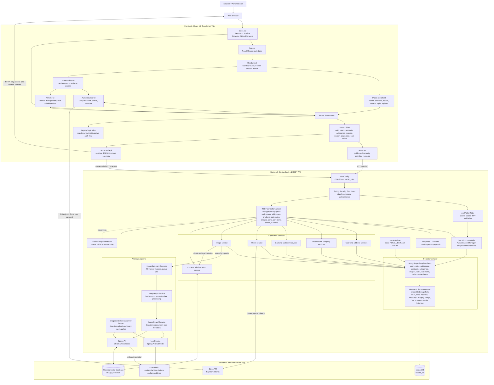

# BuyMeShop Architecture

## Overview

BuyMeShop is a two-project e-commerce application:

- **`frontend`**: a React 19 + TypeScript single-page app built with Vite 8.
- **`backend`**: a Spring Boot 4.1 REST API backed by MongoDB, Stripe payment intents, and Spring AI + Chroma for image similarity search.

At runtime, the frontend runs separately from the backend and talks to it over HTTP. The default local setup is:

| Part | Default |
| --- | --- |
| Frontend | `http://localhost:3000` |
| Backend | `http://localhost:9090` |
| API prefix | `/api/v1` |
| Database | MongoDB at `mongodb://localhost:27017/buyme_db` |
| Vector store | Chroma at `http://localhost:8000` |

## Development status snapshot

The application is already beyond scaffolding and has the main storefront flow wired end to end:

- Public browsing for products, brands, categories, and product details.
- Registration, login, logout, cookie-based session continuation, and profile/address management.
- Authenticated cart, Stripe checkout, and order history.
- Admin-facing product management, image upload/update/delete, and user-role editing.
- AI-assisted image similarity search from the storefront UI through Spring AI and Chroma.

The current state also includes a few important implementation notes:

- Authentication is now centered on HTTP-only access/refresh-token cookies plus `/auth/me`; the old `loginSlice` still exists in Redux but is no longer part of the active auth flow.
- Image uploads trigger asynchronous embedding generation in the backend, so image search depends on OpenAI and Chroma being available in development.
- Backend authorization is only partially enforced server-side: cart/order/auth-me routes are secured globally and product create/update/delete uses `@PreAuthorize("hasAuthority('ADMIN')")`, but user, address, image, category, and Chroma endpoints are currently still permitted by the backend filter chain unless protected elsewhere.
- Backend design-health checks are implemented with PMD, SpotBugs, Checkstyle, and ArchUnit. `verify` runs the complete backend test and analysis pipeline; static-analysis findings are currently reported without failing the build, while ArchUnit rules run as normal tests.
- **Resilience improvements** (recent): External service failures (OpenAI, Chroma) now return HTTP 503 instead of HTTP 500. Client timeouts are configured to prevent indefinite hangs. Specific `ExternalServiceUnavailableException` distinguishes temporary service unavailability from application errors.

## Repository layout

```text
buymeshop/
|- backend/   Spring Boot API
`- frontend/  React SPA
```

## High-level runtime architecture
```text
Browser
  -> React SPA (frontend)
      -> Redux Toolkit state + React Router
      -> Axios clients (`api`, `authApi`)
          -> Spring Boot REST API (backend)
              -> MongoDB
              -> Stripe Payment Intents API
              -> OpenAI via Spring AI
              -> Chroma vector store

Image upload/update
  -> backend `ImageService`
      -> async executor (`imageSummaryExecutor`)
          -> `LLMService` image description
          -> Chroma embedding/document storage
```
## Architecture diagram



## Frontend architecture

### Main responsibilities

- Route users through the storefront, cart, account, orders, checkout, and admin screens.
- Keep UI and request state in Redux Toolkit slices.
- Call the backend with Axios clients configured from `VITE_BASE_URL`.
- Restore the authenticated session on app load with `/auth/me`.
- Complete card payments in the browser with Stripe Elements.
- Support text/category/brand filters plus image-based product search.

### Key frontend modules

| Area | Purpose |
| --- | --- |
| `src\App.tsx` | Route table and protected/admin-only screens |
| `src\index.tsx` | Redux provider and Stripe Elements setup |
| `src\component\layout` | Shared shell: navbar, footer, root layout, toast container |
| `src\component\product` | Product listing, details, and admin product management |
| `src\component\search` | Search bar, text/category filters, and image-search upload UI |
| `src\component\cart` | Cart display and quantity/removal actions |
| `src\component\checkout` | Address selection, Stripe card entry, and order placement |
| `src\component\auth` | Login, register, profile, and route protection |
| `src\component\admin` | User administration UI |
| `src\component\services\api.tsx` | Public/authenticated Axios instances and refresh retry logic |
| `src\store\features` | Domain slices for auth, users, products, cart, orders, categories, images, search, pagination, plus a legacy login slice |

### State management

Redux is split by domain:

- **`authSlice`**: login/logout, `/auth/me`, and the authenticated user snapshot used by route guards.
- **`userSlice`**: current user, user list, address CRUD, and admin user updates.
- **`productSlice`**: product catalog, distinct brands/products, selected product, and admin product mutations.
- **`cartSlice`**: cart contents, totals, add/update/remove actions, and duplicate-request protection for `/carts/me`.
- **`orderSlice`**: order history and Stripe payment-intent client secret.
- **`searchSlice`**: text/category/image-search filters and returned product IDs.
- Additional slices support categories, image upload state, pagination, and the legacy login token holder.

### API access pattern

The SPA uses two Axios clients from `src\component\services\api.tsx`:

- **`api`** for public requests.
- **`authApi`** for cookie-backed authenticated requests with `withCredentials: true`.

`authApi` retries `401/403` responses once by calling `/auth/refresh-token` and replaying the original request.

In the current code, `authApi` is used for auth/session, cart, and order flows, while several user/address/image/admin-related calls still go through the public `api` client because those backend endpoints are not fully locked down server-side yet.

### Route protection

`ProtectedRoute` blocks anonymous users from cart, orders, profile, and checkout routes, and restricts `/manage/:productId?` and `/admin` to users whose roles include `ADMIN`.

This is stronger than the current navbar behavior: the admin navigation link is rendered unconditionally in the UI, but access to the routes themselves still depends on `ProtectedRoute`.

## Backend architecture

### Main responsibilities

- Expose REST endpoints for catalog, images, users, addresses, cart, orders, categories, authentication, and Chroma inspection.
- Authenticate users with Spring Security and JWT stored in cookies.
- Persist e-commerce documents in MongoDB.
- Create Stripe payment intents for checkout.
- Generate image descriptions through Spring AI and store/search image embeddings in Chroma.
- Seed the default `ROLE_USER` and `ADMIN` roles on application startup.

### Layering

The backend follows a conventional controller/service/repository split:

| Layer | Responsibility |
| --- | --- |
| `controller` | HTTP endpoints and response shaping |
| `service` / feature packages | Business logic |
| `repository` | MongoDB persistence via `MongoRepository` |
| `model` | MongoDB documents and embedded object graphs |
| `dtos`, `request`, `response` | API payloads |
| `security` | JWT auth, user details service, security config, and CORS |
| `exceptions` | Central exception mapping and external service failure handling |
| `data` | Startup initialization |
| `config` | Async executor wiring |

### Major backend packages

| Package | Purpose |
| --- | --- |
| `controller` | REST entry points |
| `service\product`, `service\cart`, `service\order`, `service\user`, `service\address`, `service\image` | Core commerce logic |
| `service\chroma` | Direct Chroma collection/embedding operations |
| `service\LLM\LLMService` | Image-description generation through Spring AI |
| `repository` | Mongo repositories for users, roles, carts, cart items, products, images, categories, orders, and addresses |
| `model` | Documents such as `User`, `Product`, `Cart`, `Order`, `Image`, `Address`, `Category`, and `Role` |
| `security\config` | Spring Security filter chain and MVC CORS configuration |
| `security\jwt` | JWT generation, validation, cookie extraction, and request filtering |
| `config` | Async image-summary executor |
| `data` | Default role seeding |

### Security model

- Login happens at `POST /api/v1/auth/login`.
- The backend authenticates with `AuthenticationManager` and `ShopUserDetailService`.
- A successful login returns an `AuthDto` in the response body and writes both **access** and **refresh** tokens into HTTP-only cookies.
- `AuthTokenFilter` reads the access token from the cookie on subsequent requests.
- `ShopConfig` makes the API stateless and currently requires authentication for:
  - `/api/v1/orders/**`
  - `/api/v1/carts/**`
  - `/api/v1/cartItems/**`
  - `/api/v1/auth/me`
- Method-level authorization is currently used for admin product mutations with `@PreAuthorize("hasAuthority('ADMIN')")`.

An important current limitation is that most other endpoints are still `permitAll()` at the filter-chain level, so frontend route protection is stricter than backend authorization for several admin/profile-related features.

### Persistence model

All repositories extend `MongoRepository`, so the persistence model is document-oriented rather than relational.

Important document relationships in the current design:

- **`User`** contains roles, addresses, a cart reference/object, and orders.
- **`Cart`** stores a `User`, a set of `CartItem`s, and a computed total.
- **`Order`** stores a `User`, a set of `OrderItem`s, status, total, and order date.
- **`Product`** stores category data directly; image binaries live in a separate `images` collection.
- **`Image`** stores the uploaded byte array plus a linked `Product`.
- **Chroma** stores AI-generated image-description documents keyed by image ID and tagged with `productId` metadata.

This design mixes separate Mongo collections with nested object snapshots, which matters when tracing updates across cart, user, order, product, image, and embedding data.

### API domains

| Domain | Examples |
| --- | --- |
| Auth | `/auth/login`, `/auth/refresh-token`, `/auth/logout`, `/auth/me` |
| Users | `/users`, `/users/user/{userId}`, `/users/add`, `/users/update/{userId}` |
| Addresses | `/addresses`, `/addresses/{addressId}`, `/addresses/user/{userId}` |
| Products | `/products`, `/products/product/{productId}`, `/products/add`, `/products/update/{productId}`, `/products/distinct/*` |
| Categories | `/categories/all`, `/categories/add`, `/categories/update/{id}` |
| Images | `/images/upload`, `/images/image/download/{imageId}`, `/images/search-by-image`, `/images/delete/{imageId}/delete` |
| Cart | `/carts/me`, `/carts/cart/{cartId}`, `/cartItems/add`, `/cartItems/update/{cartId}/{productId}` |
| Orders | `/orders/order`, `/orders/me`, `/orders/create-payment-intent` |
| Chroma | `/chroma/collections`, `/chroma/embeddings/{collectionId}`, `/chroma/embeddings/delete` |

### Error handling and external service resilience

External service calls (OpenAI for image descriptions, Chroma for vector search) are now handled with explicit failure modes:

- **`ExternalServiceUnavailableException`** is thrown when OpenAI or Chroma fails and caught by `GlobalExceptionHandler`, which returns HTTP 503 (Service Unavailable) with an `ApiResponse` body indicating the nature of the failure.
- **Client timeouts** are configured in `application.properties`:
  - OpenAI: 2s connection, 15s read timeout
  - Chroma: 1s connection, 5s read timeout
- **Narrow exception handling** in service layers (e.g., `ChromaService`, `LLMService`) preserves the original exception cause in the chain, aiding debugging.
- **Controllers no longer catch broad `Exception` blocks** that mask specific failure modes; validation errors, business errors, and service unavailability are handled separately.

Expected outcomes:

| Scenario | Status Code | Message Example |
| --- | --- | --- |
| Valid search, OpenAI unavailable | 503 | "Image search is temporarily unavailable" |
| Valid search, Chroma unavailable | 503 | "Vector search is temporarily unavailable" |
| Invalid MIME type | 400 | "Unsupported or missing image MIME type" |
| Valid search, no matches | 200 | Empty product ID list |
| Timeout on external call | 503 | "Image search is temporarily unavailable" |

## Key business flows

### 1. Authentication and session continuation

1. User logs in from the SPA.
2. Backend returns an auth payload and sets access/refresh-token cookies.
3. Frontend restores the session by calling `/auth/me` on app load.
4. Protected requests use `authApi` with credentials enabled.
5. If a secured request fails with `401/403`, the frontend calls `/auth/refresh-token` once and retries the original request.

### 2. Product browsing

1. Home and product pages load product, category, and brand data through public API calls.
2. Product details fetch a single product and its related images.
3. Product filters are applied in frontend state using search, category, image-search, brand, and pagination slices.

### 3. Cart management

1. Authenticated users add items through `/cartItems/add`.
2. Backend creates or reuses the current user's cart, stores cart items, and recalculates totals.
3. Frontend keeps a synchronized cart snapshot in `cartSlice`.

### 4. Checkout and ordering

1. Checkout requests a Stripe payment intent from `/orders/create-payment-intent`.
2. Stripe Elements confirms the card payment in the browser.
3. After successful payment, the SPA calls `/orders/order`.
4. Backend converts cart items into order items, decrements product inventory, saves the order, and clears the cart.

### 5. Product media ingestion

1. Admin/product-management screens upload image files with multipart form data.
2. Backend stores image bytes in MongoDB and generates download URLs.
3. The image service asynchronously generates an image description and stores it in Chroma with product metadata.
4. Product, cart, and detail UIs resolve images via `/images/image/download/{imageId}`.

### 6. Image similarity search

1. A shopper uploads an image from the search UI.
2. Backend generates a text description for the uploaded image through `LLMService`.
3. The description is used as the Chroma similarity-search query.
4. The API returns matching product IDs.
5. Frontend filters the visible catalog to those matching product IDs.

## Configuration and external dependencies

### Backend

- Spring Boot 4.1
- Java 25
- Spring Security
- Spring Data MongoDB
- ModelMapper
- JJWT
- Stripe Java SDK
- Spring AI OpenAI starter
- Spring AI Chroma vector-store starter

Key runtime settings currently come from `application.properties` plus `.env`, including:

- `server.port`
- `api.prefix`
- `spring.mongodb.uri`
- JWT expiration values and signing secret
- `STRIPE_SECRET_KEY`
- `OPEN_AI_KEY`
- `BASE_URL` for the allowed CORS origin
- `app.use-secure-cookie` for cookie behavior
- `spring.ai.vectorstore.chroma.*` for Chroma connection and collection settings

### Frontend

- React 19
- TypeScript 6
- Vite 8
- Redux Toolkit
- React Router 7
- Axios
- Stripe JS / React Stripe JS
- Bootstrap / React Bootstrap / MUI

The frontend expects environment values such as:

- `VITE_BASE_URL` for the backend API base URL
- `VITE_STRIPE_PUBLIC_KEY` for Stripe Elements initialization

## Quality and testing status

### Backend

The backend SOLID-metrics rollout is implemented as a set of complementary design-health checks rather than a single SOLID score:

| Tool | Current role | Configuration |
| --- | --- | --- |
| PMD 7.17 via Maven plugin 3.28.0 | Complexity, size, public surface, and coupling indicators | `backend\config\pmd\ruleset.xml` |
| SpotBugs Maven plugin 4.10.3.0 | Bytecode-level correctness and implementation findings | `backend\config\spotbugs\exclude.xml` |
| Checkstyle Maven plugin 3.6.0 | File length, method length, and parameter-count limits | `backend\config\checkstyle\checkstyle.xml` |
| ArchUnit 1.4.2 | Layer boundaries, dependency direction, and package-cycle checks | `backend\src\test\java\com\ecommerce\buyme\architecture` |

PMD currently checks cyclomatic and NPath complexity, NCSS count, method count, object coupling, god classes, and excessive public members. Checkstyle uses an 800-line file limit, 60-line method limit, and seven-parameter limit. SpotBugs runs with maximum analysis effort and low-priority findings enabled; its exclusion file contains narrow suppressions for intentional MongoDB entity references, injected security dependencies, and Spring Security configuration methods whose framework APIs declare broad exceptions.

The backend now has three test classes:

- `BuymeApplicationTests` verifies that the Spring application context loads.
- `LayerArchitectureTest` prevents controllers from using repositories directly, services from depending on controllers, and repositories from depending on upper layers.
- `DependencyRulesTest` rejects cycles between top-level application packages and prevents security/configuration code from depending on controllers.

The standard backend quality command is:

```powershell
cd backend
.\mvnw.cmd verify
```

The Maven `verify` lifecycle runs tests, including the blocking ArchUnit rules, followed by PMD, SpotBugs, and Checkstyle. The three static-analysis plugins are currently soft reporting gates: their findings do not fail the build. Reports can also be refreshed individually with `pmd:check`, `spotbugs:check`, and `checkstyle:check`.

### Frontend

The frontend has Testing Library dependencies installed, but no test or lint script is currently configured in `package.json`.
